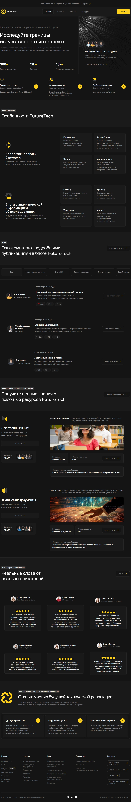
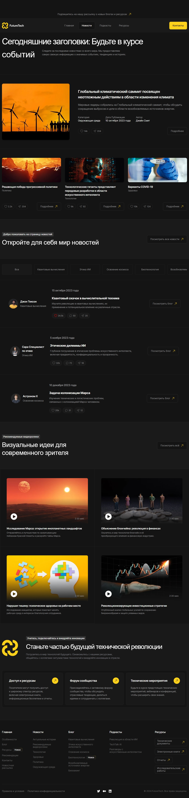

# FutureTech

Сайт медиа-платформы FutureTech о технологиях будущего на React, Vite и SCSS.

## Ссылки

- Главная: https://aaapa.github.io/future-tech/
- Новости: https://aaapa.github.io/future-tech/news
- Статья: https://aaapa.github.io/future-tech/blog-open
- Подкасты: https://aaapa.github.io/future-tech/podcasts
- Ресурсы: https://aaapa.github.io/future-tech/resources
- Контакты: https://aaapa.github.io/future-tech/contacts
- Карта сайта: https://aaapa.github.io/future-tech/sitemap.xml
- Превью сайта: https://aaapa.github.io/future-tech/site-preview.png

## Скриншоты

### Главная



### Новости



### Статья


### Подкасты


### Ресурсы


### Контакты


## Мета

- Canonical: https://aaapa.github.io/future-tech/
- Theme color: `#141414`
- Manifest: https://aaapa.github.io/future-tech/site.webmanifest

## Команды

```bash
npm install
npm run dev
npm run build
npm run deploy
```
